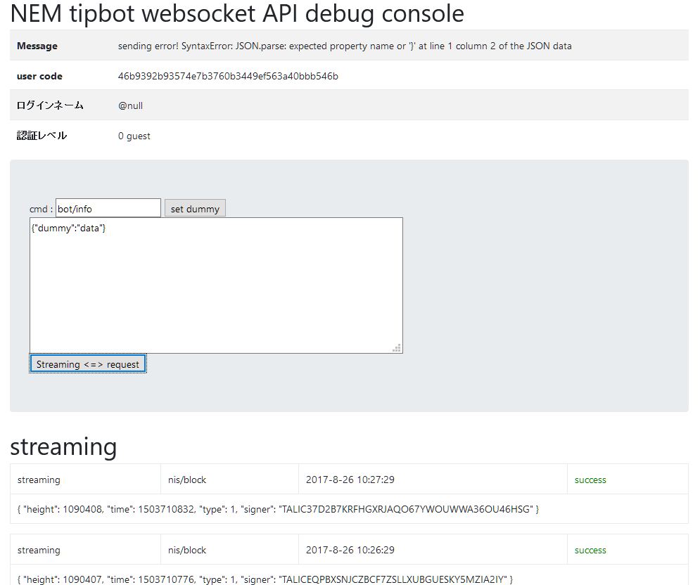
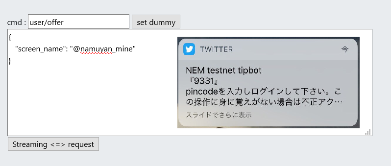
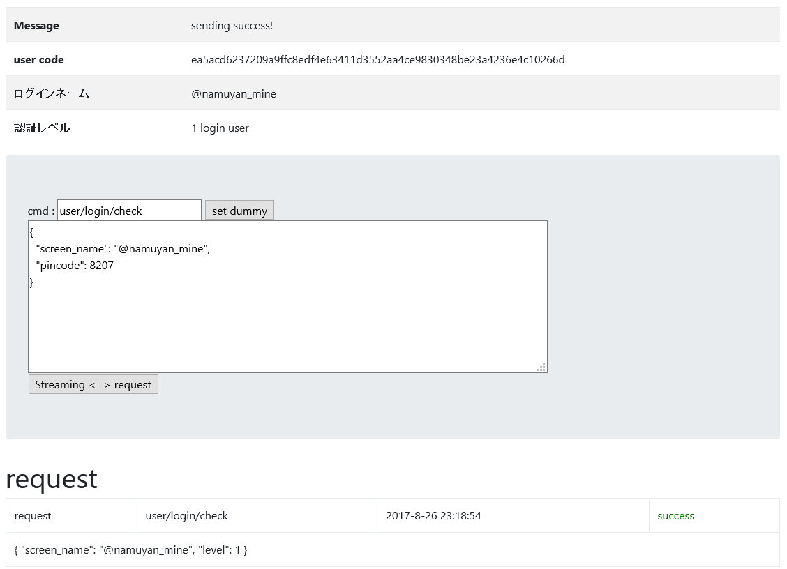

NEM Twitter tip bot login sequence
==================================

NEM tipbot はWebSocketにより、TCP上で低コストで双方向通信を確立させ、同時にユーザー管理を行っています。  
これは一度コネクション確立すると接続元の保証がされることを利用しています。

WebSocketをテストする為のツールが用意されています。[debug console]()

以下、順に解説します。
* 接続確立
* 一般ユーザーのログイン
* コンテンツクリエイター認証

## 接続確立
1. ログイン　mainnet : `ws://127.0.0.1:8359` 、testnet :`ws://127.0.0.1:8359` 
ログインすると以下のような画面になります。



2. 接続が確立されると以下のJSONﾞが返ってきます。
```json
{
"level": 0,
"user_code": "43fa420e4cb727415039aa0710165d548a8f185aee7efc71be34c1cb89130d5c",
"screen": null,
"tag": null
}
```
* 接続直後は **guest(level=0)** 扱いです。
* 各ユーザーに被らないHEXコードuser_codeが付与されます。
これはコンテンツクリエータがユーザーを識別するのに用いられます。
* screenはログインユーザー名です。Twitterアカウント名と同一です。
* tagはtipbotがユーザー管理に用いるコードです。

## 一般ユーザーとしてログイン



* `user/login/offer` にてpincodeをDM経由で発行されます。
* pincodeの有効期限は1時間で、認証に失敗すると再発行が必要になります。



* `user/login/check` にてpincodeを入力しログインユーザーになる (level=1)
* streamingよりユーザー関連情報も流れてくるようになります。


